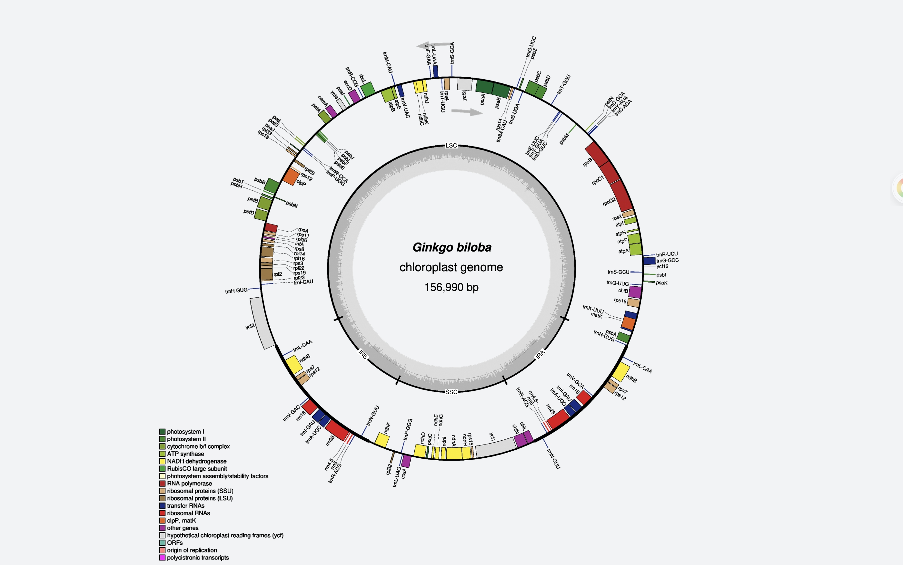

# Visualize Plastid Genome Structure

**Student:** Jade Angela Suan  
**Course:** Cell & Molecular Biology  
**Plant:** *Ginkgo biloba* (maidenhair tree)
**Family:** Ginkgoaceae  
**NCBI accession:** MN443423.1  
**Plastid genome length:** 156,990 bp  
**Software used:** OGDRAW (OrganellarGenomeDRAW)

In this lab I made a circular map of the *Ginkgo biloba* plastid genome that I characterized in the earlier plastid genome activity, and I used it to look at the genome's regions, genes and GC content. It is the same genome, MN443423.1, throughout.

## Genome Source

The genome file is the annotated GenBank record for *Ginkgo biloba* chloroplast, complete genome (MN443423.1) from NCBI Nucleotide: https://www.ncbi.nlm.nih.gov/nuccore/MN443423.1

I downloaded it in GenBank format, because the map needs the gene annotation as well as the DNA sequence. I kept the original file unchanged and only renamed it `Ginkgo_biloba_MN443423.1.gb`. It is in `data/`.

## OGDRAW Settings

I used OGDRAW at https://chlorobox.mpimp-golm.mpg.de/OGDraw.html with these settings:

- Mode: Standard
- Uploaded file: `Ginkgo_biloba_MN443423.1.gb`
- Map type: Circular
- Sequence source: Plastid
- Inverted repeats: Auto (automatic detection)
- Draw GC content graph: on
- Show direction of transcription: on
- Show full legend: on
- Label intron-containing genes with *: on
- Output format: PNG

OGDRAW did not add asterisks to the gene labels for this file. I also tried a second run with the "introns" feature ticked. It drew the introns as white boxes but dropped several genes (for example *accD*, *cemA*, *chlB*, *chlL*, *chlN*, *ccsA* and *infA*), so I used the first run, which shows all genes.

## Plastid Genome Map



*Circular map of the* Ginkgo biloba *plastid genome (MN443423.1, 156,990 bp) made with OGDRAW. The labels LSC, IRB, SSC and IRA mark the four regions. The gray ring inside shows the GC content, and the two arrows near the top show the direction of transcription.*

## Main Structural Features

The map shows the usual quadripartite plastid layout: a large single-copy region (LSC, 99,259 bp), an inverted repeat (IRb, 17,732 bp), a small single-copy region (SSC, 22,267 bp) and a second inverted repeat (IRa, 17,732 bp). I took these sizes from Yang et al. (2021), because the GenBank record does not label the repeats. The LSC covers the top and both sides of the circle, the SSC is at the bottom, and the IRs are at the lower left and lower right. The IRs are shorter than in many flowering plants, and *ycf2* appears only once, in the LSC.

Genes in the IRs appear twice on the map: the rRNA genes (*rrn16*, *rrn23*, *rrn4.5*, *rrn5*), several tRNA genes, and *ndhB*, *rps7* and *rps12*. The LSC holds genes such as *psbA*, *rbcL*, *atpB* and the RNA polymerase genes, and the SSC holds *ndhF*, *ycf1* and *rps15*. Genes are transcribed in both directions: those drawn outside the ring are transcribed counterclockwise and those inside clockwise. The GC graph is not flat, and the band looks thicker around the IRs than across most of the LSC.

## Answers

My answers to the lab questions are in [`answers/Lab_plastid_genome_answers.md`](answers/Lab_plastid_genome_answers.md).

## Folder Contents

```
README.md
data/Ginkgo_biloba_MN443423.1.gb
figures/Ginkgo_biloba_plastid_map.png
answers/Lab_plastid_genome_answers.md
```

## How to Repeat This Lab

1. Download the GenBank file for MN443423.1 from NCBI Nucleotide.
2. Open OGDRAW, choose Standard mode, upload the file, and select Circular and Plastid.
3. Use automatic inverted repeat detection, turn on the GC content graph, the direction of transcription, the full legend and the intron label option, choose PNG, tick the disclaimer and submit.
4. Save the map as `Ginkgo_biloba_plastid_map.png`.

## References

1. Greiner, S., Lehwark, P., & Bock, R. (2019). OrganellarGenomeDRAW (OGDRAW) version 1.3.1: expanded toolkit for the graphical visualization of organellar genomes. *Nucleic Acids Research*, 47, W59-W64. https://chlorobox.mpimp-golm.mpg.de/OGDraw.html
2. Yang, X., Zhou, T., Su, X., Wang, G., Zhang, X., Guo, Q., & Cao, F. (2021). Structural characterization and comparative analysis of the chloroplast genome of *Ginkgo biloba* and other gymnosperms. *Journal of Forestry Research*, 32(2), 765-778. https://doi.org/10.1007/s11676-019-01088-4
3. National Center for Biotechnology Information (NCBI). *Ginkgo biloba* chloroplast, complete genome. GenBank: MN443423.1. https://www.ncbi.nlm.nih.gov/nuccore/MN443423.1
